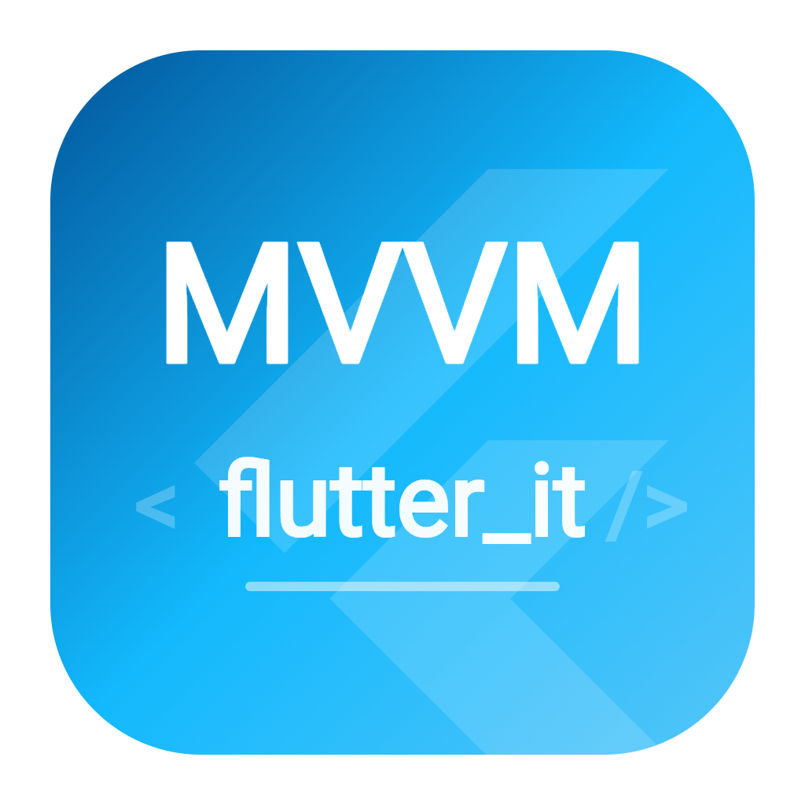
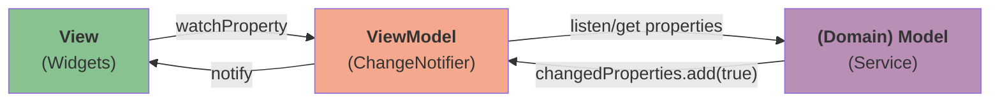

# Flutter MVVM Starter

[简体中文](./README_zh_CN.md)

A minimal Flutter app template with MVVM architecture for cross-platform development (Linux, macOS, Windows, Android).

This template is based on the [MusicPod](https://github.com/ubuntu-flutter-community/musicpod) project, simplifying the project structure while focusing on core features.

## Features

- **MVVM Architecture**: Clean separation of Model, View, and ViewModel layers
- **Cross-platform**: Support for Linux, macOS, Windows, and Android
- **Dependency Injection**: Using [get_it](https://pub.dev/packages/get_it) and [watch_it](https://pub.dev/packages/watch_it)
- **Theme Support**: Light/Dark theme with Yaru and Phoenix theme options
- **Localization Ready**: Built-in internationalization support
- **Responsive Design**: Adaptive layouts for desktop and mobile

## Getting Started

1. **Clone the repository**
   ```bash
   git clone https://github.com/dongfengweixiao/starter.git
   cd starter
   ```

2. **Customization**

   Refer to the [Customization](#customization) section below.

3. **Create platform code**

   Run the command to create platform-specific code:

   ```bash
   flutter create . --org <Your package identifier> --platforms linux,macos,windows,android
   ```

4. **Install dependencies**
   ```bash
   flutter pub get
   ```

5. **Run the app**
   ```bash
   flutter run
   ```

## Customization

Before using this template for your project, you should update the following:

### Package Name and App Identity

Search and replace these placeholders throughout the project:

| Placeholder | Description | Example |
|-------------|-------------|---------|
| `io.github.yourname.starter` | Your package identifier | `com.yourcompany.myawesome` |
| `yourname` | Your GitHub username | `johndoe` |
| `Starter App` | Your app name (Title) | `My Awesome` |
| `starter` | Your app name (snake_case) | `my_awesome` |
| `Starter` | Your app name (PascalCase) | `MyAwesome` |

Rename the following files:

- `lib/app/view/desktop_starter_app.dart` -> `lib/app/view/my_awesome_desktop_app.dart`
- `lib/app/view/mobile_starter_app.dart` -> `lib/app/view/my_awesome_mobile_app.dart`
- `lib/app/view/starter_app.dart` -> `lib/app/view/my_awesome_app.dart`

## Architecture



### Project Structure

```
lib/
├── app/
│   └── view/           # UI widgets and pages
├── common/             # Shared utilities and constants
├── extensions/         # Dart/Flutter extensions
├── l10n/              # Localization files
├── settings/          # Settings model
├── app_config.dart    # App configuration
├── main.dart          # Entry point
└── register.dart      # Dependency injection setup
```

## Platform Code Handling

### Linux
After creating Linux-related code using `flutter create . --platforms linux`, you need to modify `linux/runner/my_application.cc` to call `fl_register_plugins` before `gtk_widget_show`.

```diff
// for transparent.
   gdk_rgba_parse(&background_color, "#000000");
   fl_view_set_background_color(view, &background_color);
-  gtk_widget_show(GTK_WIDGET(view));
   gtk_container_add(GTK_CONTAINER(window), GTK_WIDGET(view));

+  fl_register_plugins(FL_PLUGIN_REGISTRY(view));
+  gtk_widget_show(GTK_WIDGET(view));

   // Show the window when Flutter renders.
   // Requires the view to be realized so we can start rendering.
   g_signal_connect_swapped(view, "first-frame", G_CALLBACK(first_frame_cb),
                            self);
   gtk_widget_realize(GTK_WIDGET(view));

-  fl_register_plugins(FL_PLUGIN_REGISTRY(view));
-
   gtk_widget_grab_focus(GTK_WIDGET(view));
 }
```

## License

MIT License - feel free to use this template for any project.
