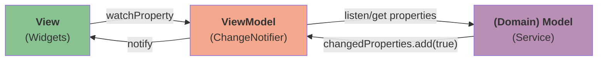

# Flutter MVVM 起始模板

一个最小化的 Flutter 应用模板，采用 MVVM 架构，支持跨平台开发（Linux、macOS、Windows、Android）。

该模板基于 [MusicPod](https://github.com/ubuntu-flutter-community/musicpod) 项目创建，简化了项目结构，聚焦于核心功能。

## 特性

- **MVVM 架构**：清晰分离 Model、View 和 ViewModel 层
- **跨平台**：支持 Linux、macOS、Windows 和 Android
- **依赖注入**：使用 [get_it](https://pub.dev/packages/get_it) 和 [watch_it](https://pub.dev/packages/watch_it)
- **主题支持**：浅色/深色主题，支持 Yaru 和 Phoenix 主题选项
- **国际化就绪**：内置国际化支持
- **响应式设计**：适配桌面和移动端的自适应布局

## 快速开始

1. **克隆仓库**
   ```bash
   git clone https://github.com/dongfengweixiao/starter.git
   cd starter
   ```

2. **自定义配置**

   参考[自定义配置](#自定义配置)章节。

3. **创建平台代码**

   执行命令创建平台代码：

   ```bash
   flutter create . --org <您的包标识符> --platforms linux,macos,windows,android
   ```

4. **安装依赖**
   ```bash
   flutter pub get
   ```

5. **运行应用**
   ```bash
   flutter run
   ```

## 自定义配置

在将此模板用于您的项目之前，应更新以下内容：

### 包名和应用标识

在整个项目中搜索并替换以下占位符：

| 占位符 | 描述 | 示例 |
|--------|------|------|
| `io.github.yourname.starter` | 您的包标识符 | `com.yourcompany.myawesome` |
| `yourname` | 您的 GitHub 用户名 | `johndoe` |
| `Starter App` | 您的应用名（标题） | `My Awesome` |
| `starter` | 您的应用名（下划线命名法） | `my_awesome` |
| `Starter` | 您的应用名（大驼峰命名法） | `MyAwesome` |

重命名以下文件：

- `lib/app/view/desktop_starter_app.dart` -> `lib/app/view/my_awesome_desktop_app.dart`
- `lib/app/view/mobile_starter_app.dart` -> `lib/app/view/my_awesome_mobile_app.dart`
- `lib/app/view/starter_app.dart` -> `lib/app/view/my_awesome_app.dart`

## 架构



### 项目结构

```
lib/
├── app/
│   └── view/           # UI 组件和页面
├── common/             # 共享工具和常量
├── extensions/         # Dart/Flutter 扩展
├── l10n/              # 国际化文件
├── settings/          # 设置模型
├── app_config.dart    # 应用配置
├── main.dart          # 入口文件
└── register.dart      # 依赖注入配置
```

## 平台代码处理

### Linux
使用 `flutter create . --platforms linux` 创建 Linux 相关代码后，需要修改 `linux/runner/my_application.cc`，在 `gtk_widget_show` 之前调用 `fl_register_plugins`。

```diff
// for transparent.
   gdk_rgba_parse(&background_color, "#000000");
   fl_view_set_background_color(view, &background_color);
-  gtk_widget_show(GTK_WIDGET(view));
   gtk_container_add(GTK_CONTAINER(window), GTK_WIDGET(view));
 
+  fl_register_plugins(FL_PLUGIN_REGISTRY(view));
+  gtk_widget_show(GTK_WIDGET(view));

   // Show the window when Flutter renders.
   // Requires the view to be realized so we can start rendering.
   g_signal_connect_swapped(view, "first-frame", G_CALLBACK(first_frame_cb),
                            self);
   gtk_widget_realize(GTK_WIDGET(view));
 
-  fl_register_plugins(FL_PLUGIN_REGISTRY(view));
-
   gtk_widget_grab_focus(GTK_WIDGET(view));
 }
```

## 许可证

MIT 许可证 - 可自由将此模板用于任何项目。
